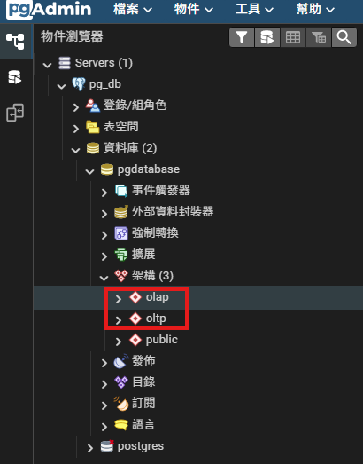

### *A.　Table Description*
- #### *OLTP*
  |**Name**|**Description**|**Remark**|
  |--:|:--:|:--:|
  | machine_events | 記錄機台運行過程中的各類事件，例如故障、維修、警報、重新啟動等事件，用於追蹤設備歷史行為。 | 用於事件追蹤與維修分析 |
  | machine_status_logs | 持續記錄機台狀態變化，例如 RUNNING、IDLE、DOWN 等，形成時間序列資料。 | 依 event_time 進行時間分區 ( Partition Table ) |
  | machines | 儲存機台基本資訊，例如機台編號、機台名稱、機台型號、所屬產線等。 | 機台主資料表 |
  | production_orders | 記錄生產訂單資訊，例如訂單編號、生產產品、目標產量、開始時間與結束時間。 | 生產排程與訂單管理 |
  | production_records | 記錄實際生產結果，例如某台機台在某時間段生產的產品與產量。 | 生產履歷資料 |
  | products | 儲存產品基本資訊，例如產品名稱、產品型號與規格。 | 產品主資料表 |
- #### *OLAP*
  |**Name**|**Description**|**Remark**|
  |--:|:--:|:--:|
  | dim_machine | 機台維度表，提供機台相關屬性，例如機台名稱、型號、產線等，用於分析時的維度資訊。 | Dimension Table |
  | dim_product | 產品維度表，包含產品名稱、產品類型與其他產品屬性，用於分析生產狀況。 | Dimension Table |
  | dim_time | 時間維度表，將時間拆分為年、月、日、小時等欄位，方便進行時間分析。 | 常見 OLAP 維度 |
  | fact_machine_status | 機台狀態事實表，記錄機台在各時間點的運行狀態統計資料，例如運行時間、停機時間等。 | Fact Table |
  | fact_production | 生產事實表，記錄機台生產產品的統計資料，例如產量、生產時間等。 | Fact Table |


<br>

### *B.　Settings Schema Mode*
```
CREATE SCHEMA oltp;
CREATE SCHEMA olap;
```



### *C.　Create Table*